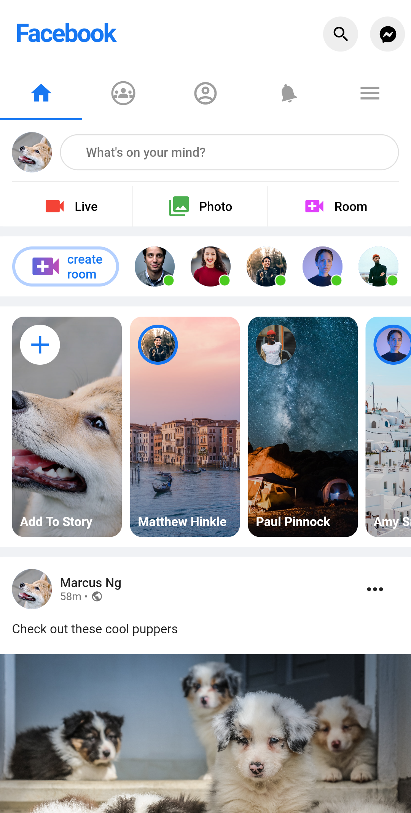

# flutter_facebook_clone

## Resources

Youtube

- https://youtu.be/HvLb5gdUfDE
- https://youtu.be/j71DiTPshiM

GitHub

- https://github.com/MarcusNg/flutter_facebookresponsive_ui
- https://github.com/santiracca/flutter-facebook-clone
- https://github.com/ahmedgulabkhan/facebook_ui_flutter

Other

- https://api.flutter.dev/flutter/widgets/WillPopScope-class.html

---

## Screenshots

|                 Feeds                  |                  Profile                  |
| :------------------------------------: | :---------------------------------------: |
|  |   |
|                 Feeds                  |                  Profile                  |
|   |    |
|                 Feeds                  |                 messenger                 |
|   |  |
